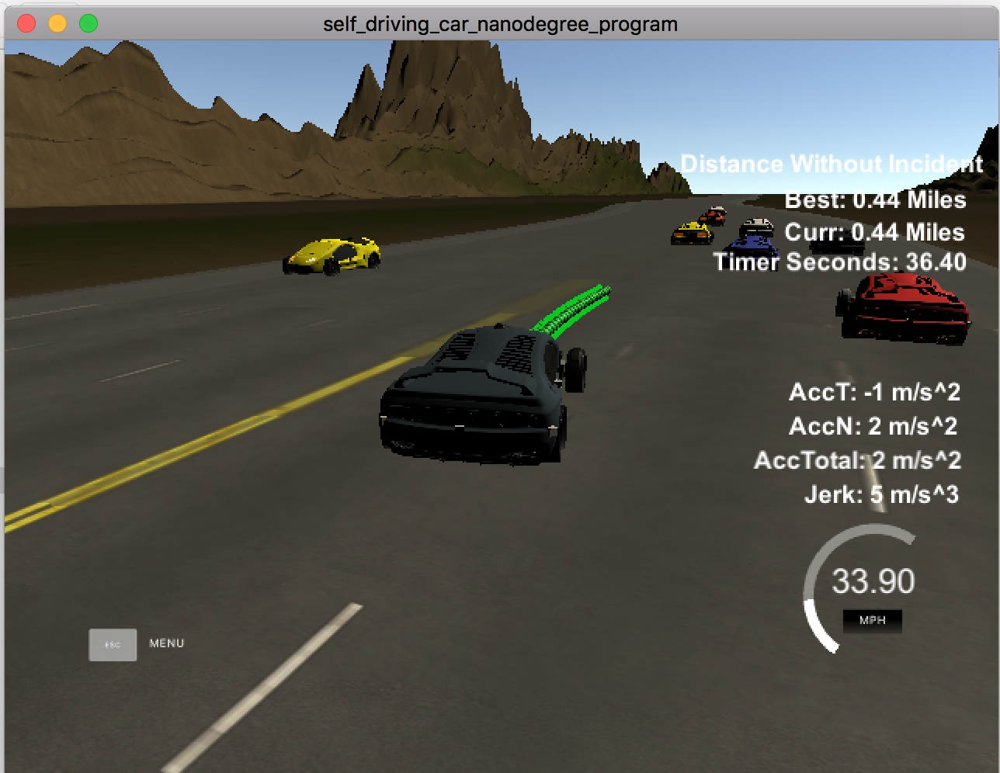
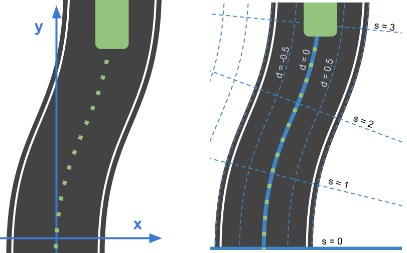
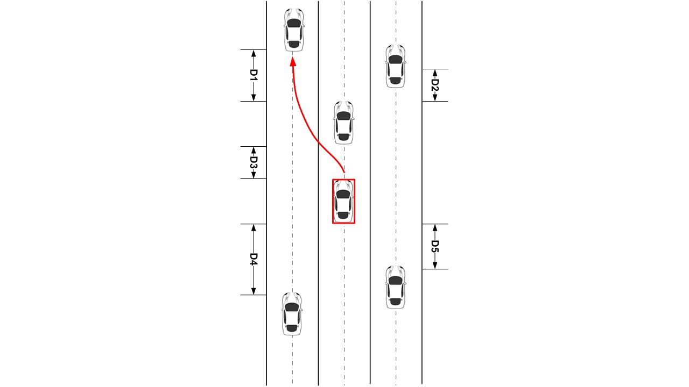
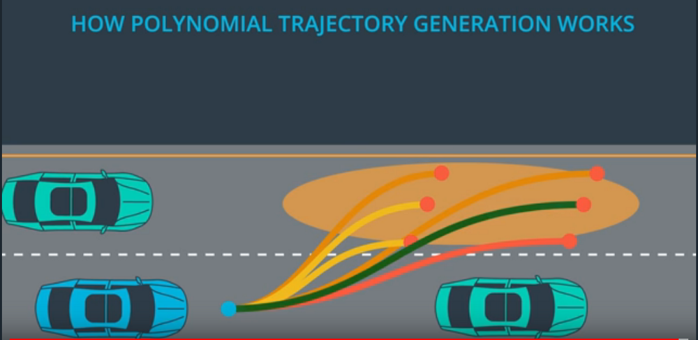

# Behavior and Path Planning for Highway Driving

In this project,  we implement a behavior and path planner in C++ that creates smooth and safe trajectories for the ego car to drive on a three-lane highway (via a Udacity simulator). There are other vehicles driving at different speeds (but approximately obeying the 50 MPH speed limit) on different lanes. The goal is for ego car to finish the lap as soon as possible without colliding with other cars. The ego car should also obey the constraints on speed,  acceleration, and jerk, as shown in the following image.



## Key Files 
All the files are included in two directory: \src and \build

In the \src directory, the following key files are included:

* main.cpp: the main file that implements behavior and path planning.
* path.h: the header files that includes path planning class (Path) and all the methods.
* vehicle.h: the header file that includes vehicle class (Vehicle) and all the methods.
* helper.h: the header file that includes all the helper functions, such as those for polynomial calculation and differentiation and jerk minimization trajectory (JMT) calculation.
* spline.h: the header file for Cubic Spline interpolation (http://kluge.in-chemnitz.de/opensource/spline/)
* json.hpp: hpp file provided for using JSON data format for the communication between the main.cpp and the simulator.  This file is included in the stater code. No modification was made.
* Eigen-3.3 directory: Eigen libraries used for JMT generations.

In the \build directory, the following key files are included:

* path_planning.exe: executable file that implements path_planning to drive the car accident-free lap of 2.74 miles on the highway.
* CMakeList.txt - build instruction for generating executable.


## Basic Build Instructions

1. Clone this repo.
2. Make a build directory: `mkdir build && cd build`
3. Compile: `cmake .. && make`
4. Run it: `./path_planning`.


## Implementation

The code model for generating paths consists of four parts that are carried out in sequence:

### Obtaining waypoints, localization data of ego car, and information of other vehicles 

In this part, the planner communicates with the simulator, reading the following information:

* Map waypoints;  
* Ego car localization data;
* Sensor fusion informations for other vehicles. 

We also make the necessary conversion from the map reference (Cartesian or X-Y coordinate) to local reference (Frenet or S-D coordinate), as shown in the following image.



### Behavioral Planning

Note the lanes are referred to as Lane 0, 1, and 2 from left to right, respectively. For behavioral planning, I consider four possible actions to be taken by a ego car.       
 
* Go straight (with the maximal speed allowed). 
* Following the leading vehicle (in the same lane). The ego car may need to adjust the speed to avoid collision.
* Make a left lane change. This is possible when ego car is on Lane 1 and Lane 2. 
* Make a right lane change. This is possible when ego car is on Lane 0 and Lane 1.

For behavioral planning, I follow simple human driving intuitions. That is, the action to be taken depends mainly on the traffic in the ego and adjacent lanes. Specifically, I come up with a "greedy" algorithm that uses the distances between the closest cars (both ahead and behind) in each lane to the ego car as decision criteria, as shown in the following figure.


For example,  if there is traffic ahead (in the same lane), we can slow down to follow the lead vehicle (by matching the speed of the lead car). If the distance between ego and front cars (denoted as D3) is too small, we can consider switching lane. In general, we switch to a lane with less traffic. For example, in the above image Lane 0 has more room than right Lane 2, that is D1 > D2. In addition, if D4 is large enough (there is enough distance between ego car and the car behind in L0), we can switch the lane.
For example, here is the code snippet that deals with the criteria to make a  turn when the ego car is in Lane 1:

```
if (ego_lane==1){ //middle lane
                    
                    if (closest_veh_dist[2]> closest_veh_dist[0]){ //Lane 2 has more room
                        if ((closest_veh_dist[2]
                             -closest_veh_dist[ego_lane] >= LANE_CHANGE_FRONT_GAP)&&
                            (abs(closest_veh_behind_dist[2]) > LANE_CHANGE_REAR_GAP))
                        {
                            change_right = true;
                            change_left = false;
                            go_straight= false;
                        }
                    }
                   else { // Lane 0 has more room
                        if ((closest_veh_dist[0]
                             -closest_veh_dist[ego_lane]>=LANE_CHANGE_FRONT_GAP)&&
                            (abs(closest_veh_behind_dist[0])>LANE_CHANGE_REAR_GAP))
                        {
                            change_left = true;
                            change_right = false;
                            go_straight= false;
                        }
                    }

```
Here, `closest_veh_dist[0]
                         -closest_veh_dist[ego_lane]>=LANE_CHANGE_FRONT_GAP)`
makes sure that lane changin happens only when there is enough gain (denoted by D1) in space.   
`(abs(closest_veh_behind_dist[1])>LANE_CHANGE_REAR_GAP)` makes sure there is enough gap (denoted by D4) behind.  In other words, ```LANE_CHANGE_FRONT_CAP``` and ```LANE_CHANGE_REAR_GAP``` indicate the risk-averseness of the ego car. Large vaules of ```LANE_CHANGE_FRONT_CAP``` and ```LANE_CHANGE_REAR_GAP``` make the ego car more cautious; while small vaules of ```LANE_CHANGE_FRONT_CAP``` and ```LANE_CHANGE_REAR_GAP``` make the ego car more "risk taking" in changing lanes.   The situations where the ego car is in left (Lane 0) and right (Lane 2) can dealt with in similar fashion.         


Once the action is decided, we generate goal points. 

```
if (go_straight){
    goal_pts = path.generate_goal_points_straight(ego_veh, too_close, lead_car_v);
}
if (change_left){
    goal_pts = path.generate_goal_points_left(ego_veh, too_close, lead_car_v);
}
if (change_right){
    goal_pts = path.generate_goal_points_right(ego_veh, too_close, lead_car_v);
}
```

### Trajectory Generation

For the goal points set, we next generate a smooth, safe, and efficient trajectory. 
```
if (go_straight){
    sd_pts = path.generate_single_SD_trajectory(start_s, start_d, goal_s,   
          goal_d, t);}
else{
    sd_pts = path.generate_optimal_SD_trajectory(start_s, start_d, goal_s, goal_d, t);}
```

That is, we follow closely the JMT formula. For left or right lane change,

JMT are generated using 

`path.generate_optimal_SD_trajectory(start_s, start_d, goal_s, goal_d, t)
`
Here we first generate candidates by randomly "perturbing" the goal points -- adding Gaussian distributed offsets (noise) in both S and D coordinates.  For each candidate trajectory, we first check its feasibility. If the trajectory violates any of the maximal speed, maximal acceleration, maximal jerk, and collision constraints, it is deemed infeasible and eliminated from the selection process. Next, for a feasible the trajectory, a sum of weighted costs associated with trajectory is calculated, assigned, and stored. The trajectory with the minimal cost is selected, as illustrated in the following image. 



### Feeding Trajectory to the Simulator

The goal is to send the generated trajectory back to simulator. To achieve this, we need to upsample the waypoints. This step is implemented in the following method in path.h:

```
generate_upsampled_waypoints(vector<double> map_waypoints_x,
                             vector<double> map_waypoints_y,
                             vector<double> map_waypoints_s,
                             vector<double> map_waypoints_dx,
                             vector<double> map_waypoints_dy,
                                    double car_s)
```
We also need to combine the newly generated points and points from previous path to ensure a smooth path. Finally we also need to transform from Frenet s,d coordinates to Cartesian x,y coordinates before sending them back to the simulator.

## Results

The simulation result is shown in [https://youtu.be/9IU-OZRXdQE](https://youtu.be/9IU-OZRXdQE).  

.
                                  
                                          
                                                 
